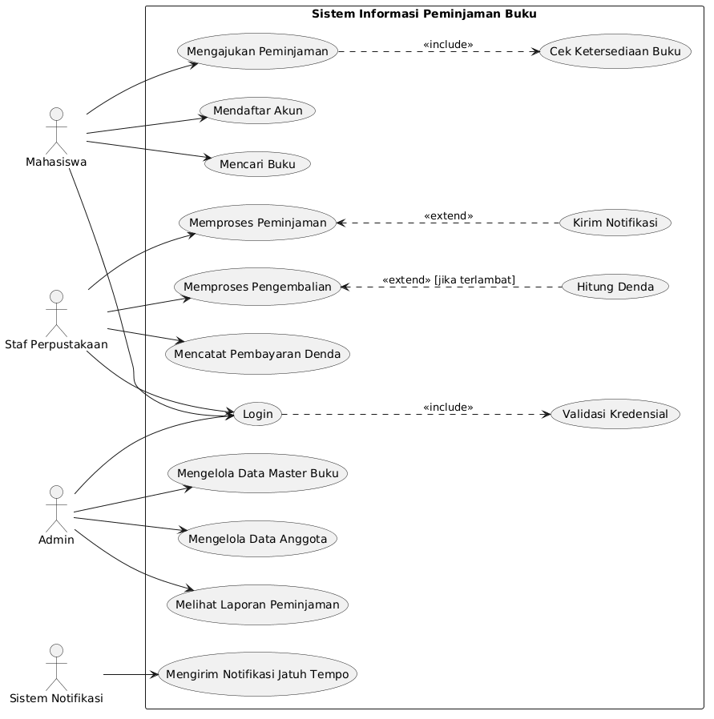

# RPL-315251020003-ARJUNA-ARRASYID

## 📌 Profil Mahasiswa
* **Nama**: Arjuna Arrasyid
* **NIM**: 315251020003
* **Mata Kuliah**: Rekayasa Perangkat Lunak (RPL)

---

## 📖 Deskripsi Proyek
Repositori ini berisi dokumentasi perancangan sistem dan arsitektur perangkat lunak. Fokus utama dari repositori ini adalah memodelkan kebutuhan dan alur sistem menggunakan berbagai diagram UML (Unified Modeling Language).

---

## 🏗️ Arsitektur Sistem & Diagram
Berikut adalah diagram arsitektur yang telah dirancang untuk memodelkan sistem ini:

### 1. Use Case Diagram
Diagram Use Case menggambarkan interaksi antara pengguna (aktor) dengan sistem, serta fungsionalitas utama yang tersedia.

### 2. Activity Diagram
Activity Diagram memvisualisasikan alur kerja (workflow) atau aktivitas dari sebuah proses di dalam sistem, dari awal hingga akhir.

### 3. Sequence Diagram
Sequence Diagram menjelaskan interaksi antar objek atau komponen dalam sistem berdasarkan urutan pesan dan waktu.

### 4. Class Diagram
Class Diagram menunjukkan struktur statis dari sistem dengan mendefinisikan kelas, atribut, metode (operasi), serta hubungan (relasi) antar kelas.

---

> *Dokumentasi ini dibuat untuk memenuhi tugas / project mata kuliah Rekayasa Perangkat Lunak.*